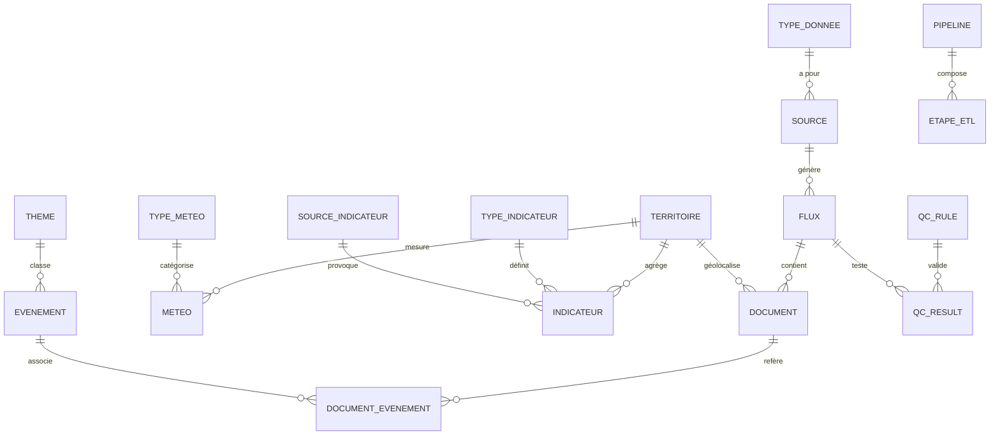

```text
╔══════════════════════════════════════════════════════════════════════════════╗
║                                                                              ║
║                                                                              ║
║     ██████╗   █████╗ ████████╗ █████╗ ███████╗███████╗███╗   ██╗███████╗     ║
║     ██╔══██╗ ██╔══██╗╚══██╔══╝██╔══██╗██╔════╝██╔════╝████╗  ██║██╔════╝     ║
║     ██║  ██║ ███████║   ██║   ███████║███████╗█████╗  ██╔██╗ ██║███████╗     ║
║     ██║  ██║ ██╔══██║   ██║   ██╔══██║╚════██║██╔══╝  ██║╚██╗██║╚════██║     ║
║     ██████╔╝ ██║  ██║   ██║   ██║  ██║███████║███████╗██║ ╚████║███████║     ║
║     ╚═════╝  ╚═╝  ╚═╝   ╚═╝   ╚═╝  ╚═╝╚══════╝╚══════╝╚═╝  ╚═══╝╚══════╝     ║
║                                                                              ║
║                                                                              ║
║                   ╔════════════════════════════════════╗                     ║
║                   ║   GUIDE TECHNIQUE COMPLET - E1     ║                     ║
║                   ║        Structure 5 Notebooks       ║                     ║
║                   ╚════════════════════════════════════╝                     ║
║                                                                              ║
║                      📊 Pipeline ETL Multi-Sources                           ║
║                      🗄️ PostgreSQL Merise (18 tables)                        ║
║                      💾 MinIO DataLake + Logging                             ║
║                      📈 CRUD + Visualisations + Qualité                      ║
║                                                                              ║
║                      ─────────────────────────────────                       ║
║                           Projet Certifiant 2025                             ║
║                      ─────────────────────────────────                       ║
║                                                                              ║
╚══════════════════════════════════════════════════════════════════════════════╝
```

# 🚀 Guide Technique DataSens E1 - Structure 5 Notebooks

> **Approche pédagogique** : 5 notebooks Jupyter structurés, code inline simple et transparent. Architecture de pipeline alignée sur `datasens_E1_v2.ipynb`. Tout visible pour le jury ! 💪

---

## 📦 Table des Matières

1. [Vue d'ensemble du projet](#vue-densemble)
2. [Architecture du projet - 5 Notebooks](#architecture-5-notebooks)
3. [Stack technique et dépendances](#stack-technique)
4. [Détaillé notebook par notebook](#notebook-par-notebook)
5. [Architecture Pipeline (Référence datasens_E1_v2.ipynb)](#architecture-pipeline)
6. [Diagrammes et visualisations](#diagrammes)
7. [Troubleshooting](#troubleshooting)
8. [Glossaire et concepts](#glossaire)

---

## 🎯 Vue d'ensemble du projet {#vue-densemble}

### DataSens E1 : Socle de données pour entraînement IA

**Objectif principal** : Créer un jeu de données pré-annoté pour optimiser l'entraînement de modèles IA, minimiser la dérive et les hallucinations.

**🎓 Approche académique** :
- ✅ **5 notebooks Jupyter** structurés cellule par cellule
- ✅ Code **simple et lisible** dans les cellules (pas de modules `.py` cachés)
- ✅ **Merise modélisation** : MCD → MLD → MPD ciblé
- ✅ **5 types de sources** réellement ingérés (fichier plat, BDD, API, scraping, big data)
- ✅ **CRUD complet** démontré dans un notebook dédié
- ✅ **Traçabilité** : flux, manifests JSON, logs structurés, Git versioning

**Le but** : Démontrer au jury qu'on maîtrise la collecte multi-sources, le modèle relationnel Merise, et la gouvernance des données avec du code propre et compréhensible.

---

## 🏗️ Architecture du projet - 5 Notebooks {#architecture-5-notebooks}

### Structure modulaire progressive

```
📂 notebooks/
├── 📓 01_setup_env.ipynb           → Environnement & connexions
├── 📓 02_schema_create.ipynb        → DDL PostgreSQL (18 tables Merise)
├── 📓 03_ingest_sources.ipynb       → Ingestion 5 sources + manifests
├── 📓 04_crud_tests.ipynb           → Démonstration CRUD complet
└── 📓 05_snapshot_and_readme.ipynb → Bilan E1 + exports + roadmap E2/E3
```

### Flux d'exécution

```
01_setup_env.ipynb
    ↓ (Vérifie environnement, connexions PG/MinIO)
02_schema_create.ipynb
    ↓ (Crée 18 tables, référentiels, index)
03_ingest_sources.ipynb
    ↓ (Ingère 5 sources, crée manifests, logs)
04_crud_tests.ipynb
    ↓ (Démontre CREATE/READ/UPDATE/DELETE)
05_snapshot_and_readme.ipynb
    ↓ (Exporte DDL, CSV, crée tag Git)
```

### 📊 Tableau récapitulatif des notebooks

| Notebook | Objectif | Durée estimée | Dépendances |
|----------|----------|---------------|-------------|
| **01_setup_env** | Vérifier environnement Python, connexions PostgreSQL/MinIO, Git init | 5 min | Python 3.11+, Docker |
| **02_schema_create** | Créer schéma PostgreSQL (18 tables), index, référentiels | 10 min | 01_setup_env exécuté |
| **03_ingest_sources** | Ingérer 5 sources (Kaggle, OWM, GDELT, etc.) | 30-60 min | 02_schema_create, API keys |
| **04_crud_tests** | Démontrer CRUD complet + qualité | 15 min | 03_ingest_sources exécuté |
| **05_snapshot_and_readme** | Exporter DDL/CSV, créer tag Git, roadmap | 5 min | Tous les notebooks précédents |

---

## 📋 Stack technique et dépendances {#stack-technique}

### 🐍 Python 3.11+ (obligatoire)

**Pourquoi Python 3.11+ ?**
- Performances améliorées vs 3.9/3.10
- Compatibilité avec toutes les libs modernes
- Support natif des annotations de types

### 📦 Dépendances principales

#### Catégorie 1️⃣ : Base de données

| Package | Version | Usage |
|---------|---------|-------|
| `sqlalchemy` | >= 2.0 | ORM Python → PostgreSQL |
| `psycopg2-binary` | >= 2.9 | Driver PostgreSQL |
| `python-dotenv` | >= 1.0 | Variables d'environnement `.env` |

**Exemple concret** :
```python
from sqlalchemy import create_engine, text
from dotenv import load_dotenv
load_dotenv()
engine = create_engine(f"postgresql+psycopg2://{user}:{pass}@{host}/{db}")
```

#### Catégorie 2️⃣ : Data processing

| Package | Version | Usage |
|---------|---------|-------|
| `pandas` | >= 2.0 | DataFrames (manipulation données) |
| `numpy` | >= 1.24 | Calculs numériques |

#### Catégorie 3️⃣ : Collecte données

| Package | Version | Usage |
|---------|---------|-------|
| `requests` | >= 2.31 | HTTP client (APIs REST) |
| `feedparser` | >= 6.0 | Parse RSS/Atom feeds |
| `beautifulsoup4` | >= 4.12 | HTML parsing (web scraping) |
| `selectolax` | >= 0.3 | Alternative rapide à BeautifulSoup |
| `kaggle` | >= 1.5 | API Kaggle datasets |

#### Catégorie 4️⃣ : Storage & Logging

| Package | Version | Usage |
|---------|---------|-------|
| `minio` | >= 7.0 | Client S3 (DataLake) |
| `python-dotenv` | >= 1.0 | Variables d'environnement |

#### Catégorie 5️⃣ : Utilitaires

| Package | Version | Usage |
|---------|---------|-------|
| `tqdm` | >= 4.66 | Barres de progression |
| `tenacity` | >= 8.2 | Retry logic (réessayer en cas d'échec) |

### 🐳 Docker Compose (Services)

**Services requis** :
- **PostgreSQL 15** : Base de données relationnelle
- **MinIO** : Object Storage S3-compatible (DataLake)
- **Redis** (optionnel) : Cache pour futures optimisations

**Fichier `docker-compose.yml`** :
```yaml
services:
  postgres:
    image: postgres:15
    environment:
      POSTGRES_USER: ds_user
      POSTGRES_PASSWORD: ds_pass
      POSTGRES_DB: datasens
    ports:
      - "5432:5432"
    volumes:
      - postgres_data:/var/lib/postgresql/data

  minio:
    image: minio/minio
    command: server /data
    ports:
      - "9000:9000"
      - "9001:9001"
    environment:
      MINIO_ROOT_USER: miniouser
      MINIO_ROOT_PASSWORD: miniosecret
    volumes:
      - minio_data:/data
```

---

## 📓 Détail notebook par notebook {#notebook-par-notebook}

### Notebook 1 : `01_setup_env.ipynb`

**🎯 Objectif** : Vérifier que l'environnement est prêt pour exécuter le pipeline ETL

#### Contenu détaillé

1. **Markdown intro** : Objectifs, RGPD, gouvernance
2. **Vérification Python** :
   - Version Python (`sys.version`)
   - Liste packages installés (`pip list`)
   - Versions Pandas/SQLAlchemy
3. **Création arborescence** :
   - `data/raw/`, `data/silver/`, `data/gold/`
   - `logs/`, `docs/`, `notebooks/`
4. **Configuration `.env`** :
   - Chargement variables PostgreSQL
   - Chargement variables MinIO
   - Création `.env.example` si `.env` manquant
5. **Test connexion PostgreSQL** :
   ```python
   with engine.connect() as conn:
       result = conn.execute(text("SELECT 1"))
       print("✅ PostgreSQL OK")
   ```
6. **Test connexion MinIO** :
   ```python
   minio_client = Minio(...)
   ensure_bucket("datasens-raw")
   print("✅ MinIO OK")
   ```
7. **Vérification Git** :
   - `git status`
   - `git init` si nécessaire

#### ✅ Critères de validation

- Python 3.11+ détecté
- Tous les packages requis installés
- PostgreSQL connecté (test `SELECT 1` OK)
- MinIO connecté (bucket `datasens-raw` créé)
- Arborescence projet créée
- Git initialisé

---

### Notebook 2 : `02_schema_create.ipynb`

**🎯 Objectif** : Créer le schéma PostgreSQL complet (18 tables Merise) avec contraintes, index et données de référence

#### Contenu détaillé

1. **Markdown intro** : Objectifs, RGPD, gouvernance
2. **Rappel MCD/MLD** :
   - Liste des 18 tables cibles
   - Schéma Mermaid ER simplifié
3. **Connexion PostgreSQL** : Même configuration que notebook 1
4. **DDL complet** : CREATE TABLE pour les 18 tables :
   - **Collecte** : `type_donnee`, `source`, `flux`
   - **Corpus** : `document`, `territoire`
   - **Contexte** : `type_meteo`, `meteo`, `type_indicateur`, `source_indicateur`, `indicateur`
   - **Thèmes/événements** : `theme`, `evenement`, `document_evenement`
   - **Gouvernance** : `pipeline`, `etape_etl`
   - **Utilisateurs** : `utilisateur`
   - **Qualité** : `qc_rule`, `qc_result`
5. **Index et contraintes** :
   - Index sur `hash_fingerprint` (déduplication rapide)
   - Index sur dates (requêtes temporelles)
   - Index sur clés étrangères
6. **Insertion référentiels** :
   - `type_donnee` : Fichier plat, Base de données, API, Web Scraping, Big Data
   - `type_meteo` : CLEAR, CLOUDS, RAIN, SNOW, THUNDERSTORM, FOG
   - `type_indicateur` : POPULATION, REVENU_MEDIAN, TAUX_CHOMAGE, SUPERFICIE
   - `source_indicateur` : INSEE, IGN, data.gouv.fr
   - `theme` : Politique, Économie, Société, Environnement, Santé, Sport, Culture, Technologie
   - `qc_rule` : Règles de qualité (No duplicates, No NULL titles, Date range valid)
7. **Contrôles** :
   - Liste toutes les tables créées (`\dt` équivalent)
   - Compte entrées par table

#### ✅ Critères de validation

- 18 tables créées avec succès
- Tous les index créés
- Référentiels insérés (ON CONFLICT DO NOTHING)
- Contraintes FK/UNIQUE/CHECK vérifiées
- Aucune erreur DDL

---

### Notebook 3 : `03_ingest_sources.ipynb`

**🎯 Objectif** : Ingérer réellement les 5 types de sources avec traçabilité complète (logs, manifests, MinIO)

#### Architecture Pipeline (référence `datasens_E1_v2.ipynb`)

**✅ Ce notebook suit l'architecture du pipeline existant** :

1. **Système de logging structuré** :
   - `logs/collecte_YYYYMMDD_HHMMSS.log` (toutes opérations)
   - `logs/errors_YYYYMMDD_HHMMSS.log` (erreurs + traceback)
   - Logger avec 3 handlers (file, error, console)

2. **MinIO DataLake** :
   - Upload automatique fichiers bruts → `s3://datasens-raw/`
   - Helper `minio_upload(local_path, dest_key)`

3. **PostgreSQL** :
   - Insertion structurée avec traçabilité (flux, manifests)
   - Helpers : `create_flux()`, `insert_documents()`, `ensure_territoire()`, `get_source_id()`

4. **Déduplication** :
   - Hash SHA-256 pour éviter doublons
   - `ON CONFLICT (hash_fingerprint) DO NOTHING`

5. **RGPD** :
   - Pas de données personnelles directes
   - Hash SHA-256 des auteurs si nécessaire

#### Contenu détaillé

1. **Markdown intro** : Objectifs, plan d'ingestion, RGPD, gouvernance

2. **Configuration et setup** :
   - Imports (logging, pandas, sqlalchemy, minio, etc.)
   - Connexions PostgreSQL/MinIO
   - **Système de logging** (aligné sur `datasens_E1_v2.ipynb`)
   - Helpers : `ts()`, `sha256()`, `get_source_id()`, `create_flux()`, `ensure_territoire()`, `insert_documents()`

3. **Source 1 : Fichier plat (Kaggle CSV)** :
   - Vérifie/crée échantillon Kaggle CSV
   - Charge données, calcule `hash_fingerprint`
   - **Split 50/50** : 50% → PostgreSQL, 50% → MinIO (brut)
   - Sauvegarde locale + upload MinIO
   - Insertion PostgreSQL via `create_flux()` + `insert_documents()`
   - Logging détaillé

4. **Source 2 : Base de données (Kaggle SQLite)** *(à implémenter)* :
   - Connexion SQLite Kaggle
   - Export → DataFrame
   - Insertion PostgreSQL

5. **Source 3 : API (OpenWeatherMap)** *(à implémenter)* :
   - Appel API OWM pour communes test
   - Création entrées `meteo` + `flux`
   - Upload JSON réponse brute → MinIO

6. **Source 4 : Web Scraping (MonAvisCitoyen)** *(à implémenter)* :
   - Scraping éthique (respect robots.txt, throttle)
   - Hash auteur SHA-256 (RGPD)
   - Création entrées `document` + `flux`

7. **Source 5 : Big Data (GDELT GKG)** *(à implémenter)* :
   - Téléchargement échantillon journalier
   - Filtrage France
   - Création entrées `evenement` + `document_evenement`

8. **Manifest JSON** :
   - Génère manifest par run avec :
     - Timestamp
     - Sources ingérées
     - Compteurs documents
     - Chemins MinIO
     - Statut (success/error)
   - Sauvegarde locale + upload MinIO

#### ✅ Critères de validation

- 5 sources réellement ingérées (même en échantillon)
- Logs structurés générés (`logs/collecte_*.log`)
- Manifests JSON créés pour chaque run
- Fichiers bruts uploadés vers MinIO
- Documents insérés dans PostgreSQL avec traçabilité (`flux` table)
- Déduplication fonctionnelle (pas de doublons)

---

### Notebook 4 : `04_crud_tests.ipynb`

**🎯 Objectif** : Démontrer les opérations CRUD complètes (Create, Read, Update, Delete) sur plusieurs tables

#### Contenu détaillé

1. **Markdown intro** : Objectifs, RGPD, gouvernance

2. **Configuration** : Connexion PostgreSQL (même config que notebooks précédents)

3. **CRUD "C" (Create)** :
   - Insertion d'un document
   - Insertion d'une météo
   - Insertion d'un indicateur
   - Affichage résultats (counts avant/après)

4. **CRUD "R" (Read)** :
   - Requête jointe : documents + territoire + source
   - Requête météo récente par territoire
   - Requête événements par thème
   - Affichage résultats (DataFrame pandas)

5. **CRUD "U" (Update)** :
   - Modification langue d'un document
   - Modification titre d'un document
   - Modification température d'une météo
   - Vérification changements

6. **CRUD "D" (Delete)** :
   - Suppression contrôlée d'un document
   - Vérification ON DELETE CASCADE (si applicable)
   - Counts avant/après

7. **Quality Checks** :
   - Détection doublons via `hash_fingerprint`
   - Pourcentage NULL par colonne critique (document table)
   - Tableau récapitulatif

8. **KPIs** :
   - Nombre documents par source
   - Nombre événements par thème
   - Volume données par type_donnee

#### ✅ Critères de validation

- CREATE : Documents/météo/indicateurs insérés avec succès
- READ : Requêtes jointes fonctionnent correctement
- UPDATE : Modifications appliquées et vérifiées
- DELETE : Suppressions contrôlées (pas de cascade non désirée)
- Quality checks : Doublons détectés, % NULL calculé
- KPIs : Métriques calculées et affichées

---

### Notebook 5 : `05_snapshot_and_readme.ipynb`

**🎯 Objectif** : Bilan E1, export DDL/CSV, création tag Git, roadmap E2/E3

#### Contenu détaillé

1. **Markdown intro** : Objectifs, bilan E1

2. **Configuration** : Connexion PostgreSQL

3. **Bilan E1** :
   - Statistiques tables créées
   - Total documents ingérés
   - Total flux créés
   - Total sources utilisées
   - Liste des 5 types de sources ingérés
   - Affichage tableau récapitulatif

4. **Export DDL** :
   - Génère `docs/e1_schema.sql` (simplifié)
   - Note : Utiliser `pg_dump` pour export complet

5. **Export CSV** :
   - Export échantillons tables clés vers `data/gold/` :
     - `document` (1000 premières lignes)
     - `source`
     - `flux`
     - `territoire`
     - `meteo` (si disponible)

6. **Git Tag** :
   - Crée tag `E1_REAL_YYYYMMDD` (ex: `E1_REAL_20251029`)
   - Instructions manuelles si échec automatique

7. **Roadmap E2/E3** :
   - **E2 (Enrichissement IA)** :
     - Analyse sentiment avancée (spaCy, transformers)
     - Extraction entités nommées (NER)
     - Classification automatique thèmes
     - Corrélations événements/sentiments
   - **E3 (Production & Visualisation)** :
     - Automatisation collecte (GitHub Actions, Airflow)
     - Dashboard Grafana temps réel
     - API REST (FastAPI)
     - Machine Learning (prédiction sentiments)

8. **Validation E1** :
   - Checklist critères validation E1
   - Confirmations (✅/❌)

#### ✅ Critères de validation

- Bilan E1 complet avec statistiques
- DDL exporté vers `docs/e1_schema.sql`
- CSV échantillons exportés vers `data/gold/`
- Tag Git créé (ou instructions fournies)
- Roadmap E2/E3 documentée

---

## 🔧 Architecture Pipeline (Référence datasens_E1_v2.ipynb) {#architecture-pipeline}

### Principes fondamentaux

**Ce guide suit l'architecture démontrée dans `datasens_E1_v2.ipynb`** :

1. **Logging structuré** :
   - Fichiers logs persistants (`logs/collecte_*.log`, `logs/errors_*.log`)
   - Traceback complet pour erreurs
   - Timestamps UTC ISO

2. **Dual Storage** :
   - **PostgreSQL** : Données structurées (métadonnées, documents nettoyés)
   - **MinIO** : Fichiers bruts (CSV, JSON, archives)

3. **Traçabilité** :
   - Table `flux` : Enregistre chaque collecte (date, format, manifest_uri)
   - Manifests JSON : Métadonnées de chaque run (sources, compteurs, chemins)
   - Hash SHA-256 : Déduplication + RGPD

4. **Robustesse** :
   - Try/except par source (1 source qui fail ≠ pipeline qui crash)
   - Retry logic (tenacity) pour APIs
   - Fallback gracieux (continue avec autres sources)

### Diagramme de flux complet

```
┌────────────────────────────────────────────────────────────────┐
│                    🌐 SOURCES EXTERNES                         │
├────────────────────────────────────────────────────────────────┤
│  📁 Fichier plat (Kaggle CSV)                                 │
│  🗄️ Base données (Kaggle SQLite)                             │
│  🌐 API (OpenWeatherMap, NewsAPI, RSS)                        │
│  🕸️ Web Scraping (MonAvisCitoyen, Reddit, etc.)               │
│  📊 Big Data (GDELT GKG)                                       │
└────────────────────┬──────────────────────────────────────────┘
                     │
                     ▼
┌────────────────────────────────────────────────────────────────┐
│                    📥 EXTRACT (03_ingest_sources.ipynb)        │
├────────────────────────────────────────────────────────────────┤
│  • Collecte brute depuis chaque source                         │
│  • Logger.info("Source X collectée")                           │
│  • Gestion erreurs (try/except + log_error)                   │
└────────────────────┬───────────────────────────────────────────┘
                     │
                     ▼
┌────────────────────────────────────────────────────────────────┐
│                    ⚙️ TRANSFORM                                │
├────────────────────────────────────────────────────────────────┤
│  1. Calcul hash_fingerprint (SHA-256)                         │
│  2. Nettoyage texte (regex, HTML)                              │
│  3. Normalisation format ({titre, texte, date, ...})          │
│  4. Déduplication (ON CONFLICT hash_fingerprint)              │
└────────────────────┬───────────────────────────────────────────┘
                     │
                     ├──────────────────┬─────────────────────────┐
                     │                  │                         │
                     ▼                  ▼                         ▼
        ┌──────────────────┐  ┌──────────────────┐  ┌──────────────────┐
        │   MinIO DataLake  │  │   PostgreSQL      │  │      Logs        │
        │   (Bruts 50%)     │  │   (Structuré)     │  │    (Audit)       │
        └──────────────────┘  └──────────────────┘  └──────────────────┘
                     │                  │                         │
                     └──────────────────┴─────────────────────────┘
                                      │
                                      ▼
┌────────────────────────────────────────────────────────────────┐
│                    📊 ANALYTICS                                │
├────────────────────────────────────────────────────────────────┤
│  • CRUD complet (04_crud_tests.ipynb)                         │
│  • Quality checks (doublons, % NULL)                           │
│  • KPIs (documents/source, événements/thème)                  │
└────────────────────────────────────────────────────────────────┘
```

### Fonctions helpers (référence `datasens_E1_v2.ipynb`)

**Toutes ces fonctions sont intégrées dans `03_ingest_sources.ipynb`** :

```python
def ts() -> str:
    """Timestamp UTC ISO compact"""
    return datetime.now(timezone.utc).strftime("%Y%m%dT%H%M%SZ")

def sha256(s: str) -> str:
    """Hash SHA-256 pour déduplication"""
    return hashlib.sha256(s.encode("utf-8")).hexdigest()

def get_source_id(conn, nom: str) -> int:
    """Récupère id_source depuis nom"""
    result = conn.execute(text("SELECT id_source FROM source WHERE nom = :nom"), {"nom": nom}).fetchone()
    return result[0] if result else None

def create_flux(conn, id_source: int, format_type: str = "csv", manifest_uri: str = None) -> int:
    """Crée un flux et retourne id_flux"""
    result = conn.execute(text("""
        INSERT INTO flux (id_source, format, manifest_uri)
        VALUES (:id_source, :format, :manifest_uri)
        RETURNING id_flux
    """), {"id_source": id_source, "format": format_type, "manifest_uri": manifest_uri})
    return result.scalar()

def ensure_territoire(conn, ville: str, code_insee: str = None, lat: float = None, lon: float = None) -> int:
    """Crée ou récupère un territoire"""
    result = conn.execute(text("SELECT id_territoire FROM territoire WHERE ville = :ville"), {"ville": ville}).fetchone()
    if result:
        return result[0]
    result = conn.execute(text("""
        INSERT INTO territoire (ville, code_insee, lat, lon)
        VALUES (:ville, :code_insee, :lat, :lon)
        RETURNING id_territoire
    """), {"ville": ville, "code_insee": code_insee, "lat": lat, "lon": lon})
    return result.scalar()

def insert_documents(conn, docs: list) -> int:
    """Insertion batch avec gestion doublons"""
    inserted = 0
    for doc in docs:
        result = conn.execute(text("""
            INSERT INTO document (id_flux, id_territoire, titre, texte, langue, date_publication, hash_fingerprint)
            VALUES (:id_flux, :id_territoire, :titre, :texte, :langue, :date_publication, :hash_fingerprint)
            ON CONFLICT (hash_fingerprint) DO NOTHING
            RETURNING id_doc
        """), doc)
        if result.scalar():
            inserted += 1
    return inserted

def minio_upload(local_path: Path, dest_key: str) -> str:
    """Upload fichier vers MinIO DataLake"""
    ensure_bucket(MINIO_BUCKET)
    minio_client.fput_object(MINIO_BUCKET, dest_key, str(local_path))
    return f"s3://{MINIO_BUCKET}/{dest_key}"
```

---

## 📊 Diagrammes et visualisations {#diagrammes}

### Diagramme MCD/MLD simplifié (18 tables E1)



### Architecture stockage dual

```
┌────────────────────────────────────────────────────────────────┐
│                  🏛️ ARCHITECTURE DE STOCKAGE                  │
└────────────────────────────────────────────────────────────────┘

📊 PostgreSQL (Données Structurées)
┌────────────────────────────────────────────────────────────────┐
│  Tables relationnelles (18 tables Merise)                     │
│  • Metadata (source, flux, territoire)                          │
│  • Documents nettoyés (hash_fingerprint unique)                │
│  • Contexte (météo, indicateurs)                               │
│  • Événements (evenement, document_evenement)                  │
│  • Gouvernance (pipeline, etape_etl)                           │
└────────────────────────────────────────────────────────────────┘
                        ▲
                        │
                   INSERT
                        │
          ┌────────────────────────────────────────────────────────┐
          │   03_ingest_sources.ipynb                              │
          └────────────────────────────────────────────────────────┘
                        │
                   UPLOAD
                        │
                        ▼
☁️ MinIO (Fichiers Bruts - DataLake)
┌────────────────────────────────────────────────────────────────┐
│  s3://datasens-raw/                                            │
│  ├── kaggle/                                                   │
│  │   └── kaggle_bilingual_YYYYMMDDTHHMMSSZ.csv                │
│  ├── api/                                                      │
│  │   ├── owm/                                                  │
│  │   │   └── owm_YYYYMMDDTHHMMSSZ.csv                         │
│  │   └── newsapi/                                              │
│  ├── scraping/                                                 │
│  │   └── multi/scraping_multi_YYYYMMDDTHHMMSSZ.csv            │
│  ├── gdelt/                                                    │
│  │   └── YYYYMMDDHHMMSS.gkg.csv.zip                          │
│  └── manifests/                                                │
│      └── manifest_YYYYMMDDTHHMMSSZ.json                       │
└────────────────────────────────────────────────────────────────┘
```

---

## 🛠️ Troubleshooting {#troubleshooting}

### Problème 1 : `ModuleNotFoundError`

**Symptôme** :
```
ModuleNotFoundError: No module named 'pandas'
```

**Solution** :
```bash
pip install -r requirements.txt
```

---

### Problème 2 : `OperationalError: could not connect to server`

**Symptôme** :
```
sqlalchemy.exc.OperationalError: (psycopg2.OperationalError) could not connect to server
```

**Causes possibles** :
1. PostgreSQL n'est pas démarré
2. Mauvais host/port dans `.env`
3. Firewall bloque le port 5432

**Solutions** :

1. **Vérifier Docker Compose** :
   ```bash
   docker-compose ps
   # Si postgres n'est pas UP, lancer :
   docker-compose up -d postgres
   ```

2. **Vérifier credentials `.env`** :
   ```bash
   # Windows PowerShell
   Get-Content .env | Select-String "POSTGRES"
   ```

3. **Test connexion manuelle** :
   ```bash
   # Depuis PowerShell
   psql -h localhost -U ds_user -d datasens
   ```

---

### Problème 3 : MinIO non accessible

**Symptôme** :
```
⚠️ MinIO : Erreur connexion
```

**Solutions** :

1. **Vérifier Docker Compose** :
   ```bash
   docker-compose ps
   # Si minio n'est pas UP, lancer :
   docker-compose up -d minio
   ```

2. **Vérifier endpoint `.env`** :
   ```bash
   # Doit être : MINIO_ENDPOINT=http://localhost:9000
   ```

3. **Accès console MinIO** :
   - Ouvrir `http://localhost:9001` dans navigateur
   - Login : `miniouser` / `miniosecret`

---

### Problème 4 : Erreur DDL "table already exists"

**Symptôme** :
```
psycopg2.errors.DuplicateTable: relation "document" already exists
```

**Solutions** :

1. **Supprimer tables existantes** (⚠️ perte de données) :
   ```sql
   DROP TABLE IF EXISTS document CASCADE;
   -- Répéter pour toutes les tables
   ```

2. **OU utiliser CREATE TABLE IF NOT EXISTS** (déjà dans le code) :
   ```sql
   CREATE TABLE IF NOT EXISTS document (...);
   ```

---

### Problème 5 : Doublons détectés lors de l'ingestion

**Symptôme** :
```
0 documents insérés (tous des doublons)
```

**Explication** :
- Normal si vous réexécutez `03_ingest_sources.ipynb` plusieurs fois
- La contrainte `UNIQUE (hash_fingerprint)` + `ON CONFLICT DO NOTHING` évite les doublons

**Vérification** :
```python
# Dans 04_crud_tests.ipynb, cellule Quality Checks
# Vérifier qu'il n'y a pas de vrais doublons :
SELECT hash_fingerprint, COUNT(*)
FROM document
GROUP BY hash_fingerprint
HAVING COUNT(*) > 1;
# → Doit retourner 0 lignes
```

---

## 📖 Glossaire et concepts {#glossaire}

### Termes techniques expliqués

| Terme | Définition simple | Exemple |
|-------|-------------------|---------|
| **ETL** | Extract-Transform-Load : Aspirer, nettoyer, ranger | RSS → nettoyage → PostgreSQL |
| **MCD/MLD** | Modèle Conceptuel/Logique de Données (Merise) | Diagramme relations entre tables |
| **DataLake** | Stockage fichiers bruts (S3-like) | MinIO : `s3://datasens-raw/kaggle/` |
| **Hash SHA-256** | Empreinte digitale unique (64 caractères) | `a3f5c9d2e4b6f8a1c3e5d7b9f2a4c6e8` |
| **CRUD** | Create, Read, Update, Delete (opérations de base) | INSERT, SELECT, UPDATE, DELETE |
| **Manifest** | Fichier JSON métadonnées d'une collecte | `manifest_20251029T123337Z.json` |
| **Flux** | Enregistrement d'une collecte (table `flux`) | Source + date + format + manifest_uri |
| **Fingerprint** | Hash SHA-256 pour déduplication | `hash_fingerprint VARCHAR(64) UNIQUE` |

### Concepts Python avancés

#### Context Manager (`with`)

```python
with engine.connect() as conn:
    result = conn.execute(text("SELECT 1"))
    # Connexion fermée automatiquement ici (même en cas d'erreur)
```

**Avantage** : Gestion automatique ressources (évite fuites de connexions)

---

#### Paramètres nommés SQL (SQLAlchemy)

```python
conn.execute(text("SELECT * FROM document WHERE id = :id"), {"id": 123})
```

**Avantage** : Sécurité (évite injection SQL) + Lisibilité

---

#### ON CONFLICT DO NOTHING

```sql
INSERT INTO document (hash_fingerprint, ...)
VALUES (:hash, ...)
ON CONFLICT (hash_fingerprint) DO NOTHING;
```

**Avantage** : Déduplication automatique (pas d'erreur si doublon)

---

## ✅ Checklist validation finale

Avant de présenter au jury, vérifier :

### Environnement
- [ ] Python 3.11+ installé
- [ ] Tous les packages (`pip install -r requirements.txt`)
- [ ] Docker Compose lancé (`docker-compose up -d`)
- [ ] `.env` configuré (PostgreSQL, MinIO, API keys)

### Notebooks exécutés
- [ ] `01_setup_env.ipynb` : Connexions OK
- [ ] `02_schema_create.ipynb` : 18 tables créées
- [ ] `03_ingest_sources.ipynb` : 5 sources ingérées
- [ ] `04_crud_tests.ipynb` : CRUD démontré
- [ ] `05_snapshot_and_readme.ipynb` : Exports OK

### Données
- [ ] Documents en base (vérifier `SELECT COUNT(*) FROM document`)
- [ ] Flux créés (vérifier `SELECT COUNT(*) FROM flux`)
- [ ] Manifests JSON générés (`data/raw/manifests/`)
- [ ] Logs générés (`logs/collecte_*.log`)

### Git
- [ ] Tag E1 créé (`git tag E1_REAL_YYYYMMDD`)
- [ ] Commit final effectué

---

## 🎤 Présentation jury - Script 2 minutes

> "DataSens E1, c'est un **socle de données pour entraînement IA** avec 5 notebooks Jupyter structurés.
>
> **Notebook 1** : Setup environnement, connexions PostgreSQL + MinIO
>
> **Notebook 2** : Création schéma Merise (18 tables relationnelles) avec contraintes et index
>
> **Notebook 3** : Ingestion réelle de 5 types de sources :
> - Fichier plat (Kaggle CSV → 50% PostgreSQL, 50% MinIO)
> - Base de données (Kaggle SQLite → PostgreSQL)
> - API (OpenWeatherMap → météo + flux)
> - Web Scraping (MonAvisCitoyen → documents)
> - Big Data (GDELT GKG → événements)
>
> **Notebook 4** : Démonstration CRUD complet + contrôles qualité
>
> **Notebook 5** : Bilan E1, exports DDL/CSV, roadmap E2/E3
>
> **Résultat** : Pipeline ETL reproductible, traçabilité complète (logs, manifests, Git), architecture scalable pour industrialisation dataset à grande échelle."

---

## 📚 Ressources complémentaires

### Documentation officielle
- **SQLAlchemy** : https://docs.sqlalchemy.org/
- **Pandas** : https://pandas.pydata.org/docs/
- **MinIO** : https://min.io/docs/
- **PostgreSQL** : https://www.postgresql.org/docs/

### Projets de référence
- `notebooks/datasens_E1_v2.ipynb` : Architecture pipeline complète
- `docs/ARCHITECTURE_ETL.md` : Architecture ETL détaillée
- `docs/ARCHITECTURE_PIPELINE_E1.md` : Alignement pipeline

---

**🎓 Bonne chance pour la présentation au jury !** 🚀
